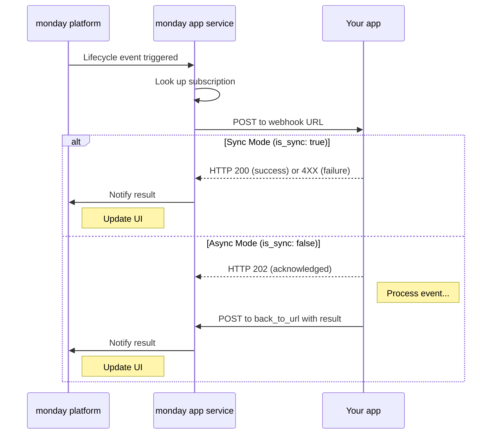

# Get app lifecycle subscriptions

Learn how to read, update, and delete app feature-level lifecycle event subscriptions via the platform API

<Callout icon="🚧" theme="warn">
  **Only available in versions [`2026-04`](https://developer.monday.com/api-reference/docs/release-notes#2026-04) and later**
</Callout>

[Feature-level lifecycle event subscriptions](https://developer.monday.com/apps/docs/feature-level-lifecycle-event-subscriptions) let app developers receive webhook notifications when users interact with specific app feature instances (for example, when a board view is duplicated, an object is created, or a column extension is deleted). These subscriptions give developers fine-grained control over how and where events are delivered.

* **Feature-level subscriptions:** Subscribe only to the feature-level events you care about
* **Per-event routing:** Route different event types to different webhook endpoints
* **Sync/async handling:** Choose synchronous or asynchronous handling per event
* **Clear identifiers**: Manage subscriptions using clear feature identifiers

<Accordion title="Supported Event Types">
  <table>
    <thead>
      <tr>
        <th>Event Type</th>
        <th>Description</th>
      </tr>
    </thead>

    <tbody>
      <tr><td>AppFeatureBoardColumnExtension:delete</td><td>When a column extension is deleted</td></tr>
      <tr><td>AppFeatureBoardColumnExtension:duplicate</td><td>When a column extension is duplicated</td></tr>
      <tr><td>AppFeatureBoardColumnExtension:export</td><td>When a column extension is exported</td></tr>
      <tr><td>AppFeatureBoardView:delete</td><td>When a board view containing your app feature is deleted</td></tr>
      <tr><td>AppFeatureBoardView:duplicate</td><td>When a board view containing your app feature is duplicated</td></tr>
      <tr><td>AppFeatureBoardView:restore</td><td>When a board view containing your app feature is restored</td></tr>
      <tr><td>AppFeatureColumn:create</td><td>When a custom column is created</td></tr>
      <tr><td>AppFeatureColumn:delete</td><td>When a custom column is deleted</td></tr>
      <tr><td>AppFeatureObject:archive</td><td>When a custom object instance is archived</td></tr>
      <tr><td>AppFeatureObject:create</td><td>When a custom object instance is created</td></tr>
      <tr><td>AppFeatureObject:delete</td><td>When a custom object instance is deleted</td></tr>
      <tr><td>AppFeatureObject:duplicate</td><td>When a custom object instance is duplicated</td></tr>
      <tr><td>AppFeatureObject:import</td><td>When custom objects are imported</td></tr>
      <tr><td>AppFeatureObject:publish</td><td>When a custom object is published</td></tr>
      <tr><td>AppFeatureObject:restore</td><td>When a custom object instance is restored from the archive</td></tr>
      <tr><td>AppFeatureObject:unpublish</td><td>When a custom object is unpublished</td></tr>
      <tr><td>AppFeatureObject:update\_attributes</td><td>When a custom object's attributes are updated</td></tr>
    </tbody>
  </table>
</Accordion>

# Queries

## Get  app lifecycle subscriptions

* Only works for **app collaborators**
* Returns an array containing metadata about an app's feature-level lifecycle event subscriptions
* Can only be queried directly at the root; can't be nested within another query

```graphql
query {
  get_app_lifecycle_subscriptions(app_id: "123", version_id: "456") {
    id
    entity_id
    event_type
    webhook_url
    is_sync
  }
}
```

### Arguments

| Argument    | Type  | Description                                                                                |
| :---------- | :---- | :----------------------------------------------------------------------------------------- |
| app\_id     | `ID!` | The app's unique identifier.                                                               |
| version\_id | `ID`  | The app version's unique identifier. If not provided, the active version will be returned. |

### Fields

| Field        | Type      | Description                                                                                                    |
| :----------- | :-------- | :------------------------------------------------------------------------------------------------------------- |
| created\_at  | `Date`    | The subscription's creation date.                                                                              |
| entity\_id   | `ID`      | The entity's unique identifier or complete slug.                                                               |
| entity\_type | `String`  | The type of entity (e.g., "appFeature").                                                                       |
| event\_type  | `String`  | The lifecycle event type (e.g., "AppFeatureColumn:create"). View the full list of supported event types above. |
| id           | `ID`      | The subscription's unique identifier.                                                                          |
| is\_sync     | `Boolean` | Whether the app’s handling of the event is synchronous.                                                        |
| updated\_at  | `Date`    | The subscription's last updated date.                                                                          |
| webhook\_url | `String`  | The webhook URL for notifications.                                                                             |

# Mutations

* Event types must match the app feature type. For example, you cannot subscribe to `AppFeatureObject:create` events on a board view app feature.
* :construction: You can't delete subscriptions for live app versions.

## Update app lifecycle subscription

Updates all existing subscriptions' configurations. Returns [`[LifecycleSubscriptionKind!]`](https://developer.monday.com/api-reference/reference/app-lifecycle-subscriptions#fields).

```graphql
mutation {
  update_app_lifecycle_subscription(
    entity_identifier: "my-app::my-object-feature"
    entity_type: "appFeature"
    input: {
      lifecycle_events: [
        {
          event_type: "AppFeatureObject:create"
          webhook_url: "https://myapp.com/webhooks/lifecycle"
          is_sync: false
        }
        {
          event_type: "AppFeatureObject:delete"
          webhook_url: "https://myapp.com/webhooks/lifecycle"
          is_sync: false
        }
        {
          event_type: "AppFeatureObject:update_attributes"
          webhook_url: "https://myapp.com/webhooks/lifecycle"
          is_sync: true
        }
      ]
    }
  ) {
    id
    event_type
    webhook_url
    is_sync
  }
}
```

### Arguments

| Argument           | Type                                                                                                                                                                   | Description                                                                                                                                                       |
| :----------------- | :--------------------------------------------------------------------------------------------------------------------------------------------------------------------- | :---------------------------------------------------------------------------------------------------------------------------------------------------------------- |
| entity\_identifier | `ID!`                                                                                                                                                                  | The entity's unique identifier or complete slug (e.g., `app_slug::feature_slug`). If using the slug, the request is applied to the app’s resolved active version. |
| entity\_type       | `String!`                                                                                                                                                              | The entity's type. Currently only supports `appFeature`.                                                                                                          |
| input              | [`UpdateLifecycleSubscriptionsInput!`](https://developer.monday.com/api-reference/reference/app-lifecycle-subscriptions-other-types#updatelifecyclesubscriptionsinput) | The entity's lifecycle event configuration input.                                                                                                                 |

<Callout icon="💡" theme="default">
  When using a full app slug, the API automatically resolves which app version the request applies to.

  * If the active version is a draft, the request is applied to that draft version.
  * If the active version is not opted in (i.e., not draft-enabled), the request is applied to the live version.
  * If there is no live version, the request is applied to the latest draft version.
</Callout>

## Delete app lifecycle subscription

Deletes all app lifecycle subscriptions. Returns a Boolean indicating if the deletion was successful or if no subscriptions exist.

```graphql
mutation {
  delete_app_lifecycle_subscription(
    entity_identifier: "my-app::my-object-feature"
    entity_type: "appFeature"
  )
}
```

### Arguments

| Argument           | Type     | Description                                                                                                                              |
| :----------------- | :------- | :--------------------------------------------------------------------------------------------------------------------------------------- |
| entity\_identifier | `String` | The entity's unique identifier or complete slug (e.g., `app_slug::feature_slug`). If using the slug, the active version will be deleted. |
| entity\_type       | `String` | The entity's type. Currently only supports `appFeature`.                                                                                 |

# Event flow

Once a feature-level lifecycle subscription is configured via the API, the following flow occurs whenever a subscribed event is triggered.



## Webhook security

All feature-level lifecycle webhook requests are authenticated using a JWT signed with your app’s signing secret.

Your server **must** [verify the JWT](https://developer.monday.com/apps/docs/authorization-header#verifying-the-jwt) in each request to confirm it was sent by monday.com. Receiving a payload without verifying the signature doesn't guarantee that the request is authentic.

## Webhook request

When a subscribed feature-level event is triggered, monday.com sends a POST request to the configured webhook URL.

<Tabs>
  <Tab title="Headers">
    <ul>
      <li><strong>Authorization:</strong> JWT signed with your app’s signing secret (used to verify the request came from monday)</li>
      <li><strong>Content-Type:</strong> application/json</li>
      <li><strong>X-Apps-Event-Id:</strong> Unique event ID for tracking</li>
    </ul>
  </Tab>

  <Tab title="Request Body">
    ```json
    {
      "type": "AppFeatureObject:create",
      "payload": {
        // Event-specific data
      },
      "accountId": 12345,
      "userId": 67890,
      "back_to_url": "https://monday-apps-ms.monday.com/api/webhooks/response/{jobId}"
    }
    ```
  </Tab>
</Tabs>

### Verifying the webhook request

To ensure the request was sent by monday.com:

1. Retrieve the JWT from the `Authorization` header.
2. Verify the JWT signature using your app’s signing secret.
3. Reject the request if verification fails.

Read more about the `Authorization` header [here](https://developer.monday.com/apps/docs/authorization-header).

## Synchronous vs asynchronous mode

Each feature-level lifecycle event can be handled independently, either synchronously or asynchronously.

<Tabs>
  <Tab title="Asynchronous Mode">
    <ul>
      <li>Respond with <strong>HTTP 202</strong> to acknowledge receipt</li>
      <li>Process the event in the background</li>
      <li>Call <code>back\_to\_url</code> when processing is complete</li>
    </ul>

    <p><strong>Async Response Example</strong></p>

    ```bash
    curl -X POST "{back_to_url}" \
      -H "Content-Type: application/json" \
      -d '{"success": true}'
    ```

    <p><strong>Best for:</strong> Complex calculations, external API calls, database operations, file processing</p>
  </Tab>

  <Tab title="Synchronous Mode">
    <ul>
      <li>Respond immediately with <strong>HTTP 200</strong> (success) or <strong>4XX</strong> (failure)</li>
      <li>Use when processing is fast and immediate feedback is required</li>
    </ul>

    <p>
      <strong>Best for:</strong> Simple validations, quick data transforms, immediate error responses
    </p>
  </Tab>
</Tabs>

<Tabs>
  <Tab title="Asynchronous Mode">
    <ul>
      <li>Respond with <strong>HTTP 202</strong> to acknowledge receipt</li>
      <li>Process the event in the background</li>
      <li>Call <code>back\_to\_url</code> when processing is complete</li>
    </ul>

    <p><strong>Async Response Example</strong></p>

    ```bash
    curl -X POST "{back_to_url}" \
      -H "Content-Type: application/json" \
      -d '{"success": true}'
    ```

    <p><strong>Best for:</strong> Complex calculations, external API calls, database operations, file processing</p>
  </Tab>

  <Tab title="Synchronous Mode">
    <ul>
      <li>Respond immediately with <strong>HTTP 200</strong> (success) or <strong>4XX</strong> (failure)</li>
      <li>Use when processing is fast and immediate feedback is required</li>
    </ul>

    <p>
      <strong>Best for:</strong> Simple validations, quick data transforms, immediate error responses
    </p>
  </Tab>
</Tabs>

<br />
