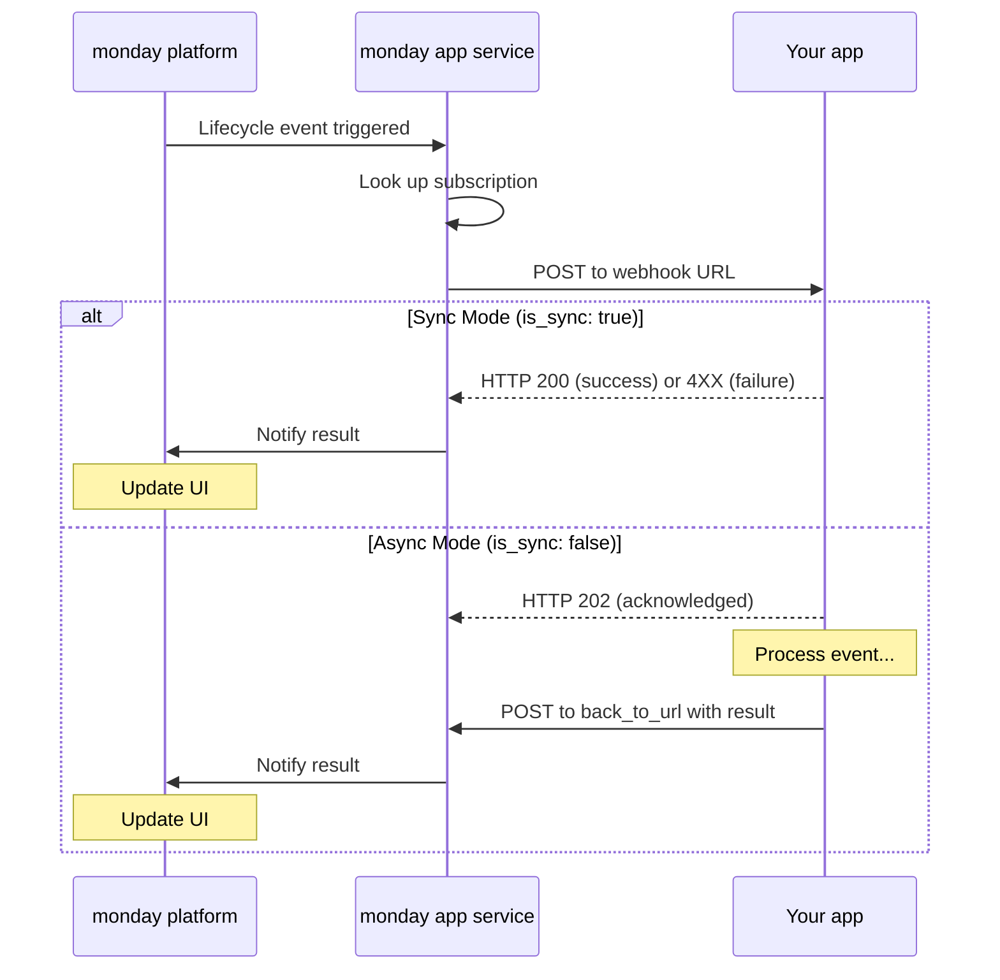

# Feature-level lifecycle event subscriptions

Feature-level lifecycle event subscriptions let app developers receive webhook notifications when users interact with specific app features (e.g., when a board view is duplicated, an object is created, or a column extension is deleted).

This capability extends monday.com's lifecycle events beyond the app level, giving you fine-grained control over which feature-level events your app listens to and how each event is handled.

# Overview

With feature-level lifecycle event subscriptions, you can subscribe to lifecycle events per app feature, rather than handling all events at the app level through a single webhook.

You can:

* Subscribe only to the feature-level events you care about
* Route different events to different webhooks endpoints
* Choose synchronous or asynchronous handling per event
* Manage subscriptions using clear feature identifiers

This enables you to design your backend around the behavior of individual features instead of funneling all lifecycle events through a single endpoint.

For example, you might route board view duplication events to one service while handling column extension deletions in another, depending on your app’s architecture.

# Supported event types

Feature-level lifecycle events are supported across several app feature types. Each event type is associated with a specific app feature type and must match the feature you're subscribing to.

## Board view events

| Event Type                      | Description                |
| :------------------------------ | :------------------------- |
| `AppFeatureBoardView:delete`    | A board view is deleted    |
| `AppFeatureBoardView:duplicate` | A board view is duplicated |
| `AppFeatureBoardView:restore`   | A board view is restored   |

## Column extension events

| Event Type                                 | Description                      |
| :----------------------------------------- | :------------------------------- |
| `AppFeatureBoardColumnExtension:delete`    | A column extension is deleted    |
| `AppFeatureBoardColumnExtension:duplicate` | A column extension is duplicated |
| `AppFeatureBoardColumnExtension:export`    | A column extension is exported   |

## Custom column events

| Event Type                        | Description                                        |
| :-------------------------------- | :------------------------------------------------- |
| `AppFeatureColumn:create`         | A custom column is created                         |
| `AppFeatureColumn:delete`         | A custom column is deleted                         |
| `AppFeatureColumn:board_deleted`  | The board containing the custom column is deleted  |
| `AppFeatureColumn:board_restored` | The board containing the custom column is restored |

## Custom object events

| Event Type                           | Description                                  |
| :----------------------------------- | :------------------------------------------- |
| `AppFeatureObject:archive`           | A custom object is archived                  |
| `AppFeatureObject:create`            | A custom object is created                   |
| `AppFeatureObject:delete`            | A custom object is deleted                   |
| `AppFeatureObject:duplicate`         | A custom object is duplicated                |
| `AppFeatureObject:import`            | A custom object is imported                  |
| `AppFeatureObject:publish`           | A custom object is published                 |
| `AppFeatureObject:restore`           | A custom object is restored from the archive |
| `AppFeatureObject:unpublish`         | A custom object is unpublished               |
| `AppFeatureObject:update_attributes` | A custom object's attributes are updated     |

<Callout icon="💡" theme="default">
  Event types must match the app feature type. For example, you can't subscribe to `AppFeatureObject:* `events on a board view app feature.
</Callout>

<Callout icon="📘">
  Some events may include an `event_action_origin` field that provides extra context about why the event occurred. For example, `AppFeatureColumn:board_deleted` can use this field to indicate whether the event was triggered because the board was deleted or archived.
</Callout>

# Manage feature-level subscriptions

Feature-level lifecycle subscriptions are fully self-serve and managed through a dedicated [GraphQL API](https://developer.monday.com/api-reference/reference/get-app-lifecycle-subscriptions). Subscriptions are configured per app feature and per event type, allowing you to control:

* Which feature-level events your app listens to
* Where each event is delivered
* Whether each event is handled synchronously or asynchronously

This allows you to route different feature interactions to different services and choose the most appropriate handling mode for each event.

# Event flow

Once a feature-level lifecycle subscription is configured via the API, the following flow occurs whenever a subscribed event is triggered.



## Webhook security

All feature-level lifecycle webhook requests are authenticated using a JWT signed with your app’s signing secret.

Your server **must** [verify the JWT](https://developer.monday.com/apps/docs/authorization-header#verifying-the-jwt) in each request to confirm it was sent by monday.com. Receiving a payload without verifying the signature doesn't guarantee that the request is authentic.

## Webhook request

When a subscribed feature-level event is triggered, monday.com sends a POST request to the configured webhook URL.

<Tabs>
  <Tab title="Headers">
    <ul>
      <li><strong>Authorization:</strong> JWT signed with your app’s signing secret (used to verify the request came from monday)</li>
      <li><strong>Content-Type:</strong> application/json</li>
      <li><strong>X-Apps-Event-Id:</strong> Unique event ID for tracking</li>
    </ul>
  </Tab>

  <Tab title="Request Body">
    ```json
    {
      "type": "AppFeatureObject:create",
      "payload": {
        // Event-specific data
      },
      "accountId": 12345,
      "userId": 67890,
      "back_to_url": "https://monday-apps-ms.monday.com/api/webhooks/response/{jobId}"
    }
    ```
  </Tab>
</Tabs>

### Verifying the webhook request

To ensure the request was sent by monday.com:

1. Retrieve the JWT from the `Authorization` header.
2. Verify the JWT signature using your app’s signing secret.
3. Reject the request if verification fails.

Read more about the `Authorization` header [here](https://developer.monday.com/apps/docs/authorization-header).

## Synchronous vs asynchronous mode

Each feature-level lifecycle event can be handled independently, either synchronously or asynchronously.

<Tabs>
  <Tab title="Asynchronous Mode">
    <ul>
      <li>Respond with <strong>HTTP 202</strong> to acknowledge receipt</li>
      <li>Process the event in the background</li>
      <li>Call <code>back\_to\_url</code> when processing is complete</li>
    </ul>

    <p><strong>Async Response Example</strong></p>

    ```bash
    curl -X POST "{back_to_url}" \
      -H "Content-Type: application/json" \
      -d '{"success": true}'
    ```

    <p><strong>Best for:</strong> Complex calculations, external API calls, database operations, file processing</p>
  </Tab>

  <Tab title="Synchronous Mode">
    <ul>
      <li>Respond immediately with <strong>HTTP 200</strong> (success) or <strong>4XX</strong> (failure)</li>
      <li>Use when processing is fast and immediate feedback is required</li>
    </ul>

    <p>
      <strong>Best for:</strong> Simple validations, quick data transforms, immediate error responses
    </p>
  </Tab>
</Tabs>

<br />
